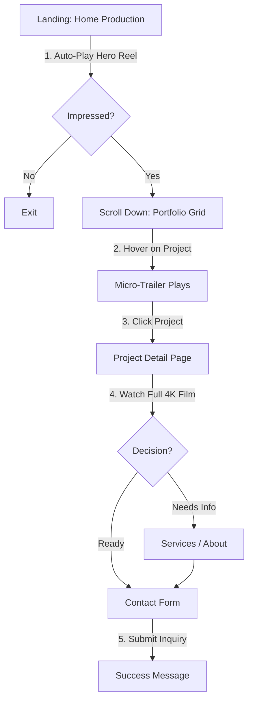
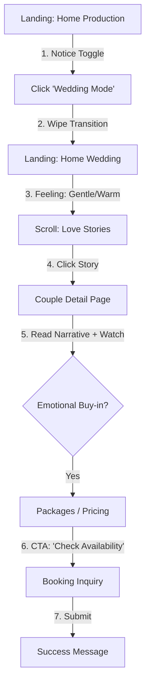
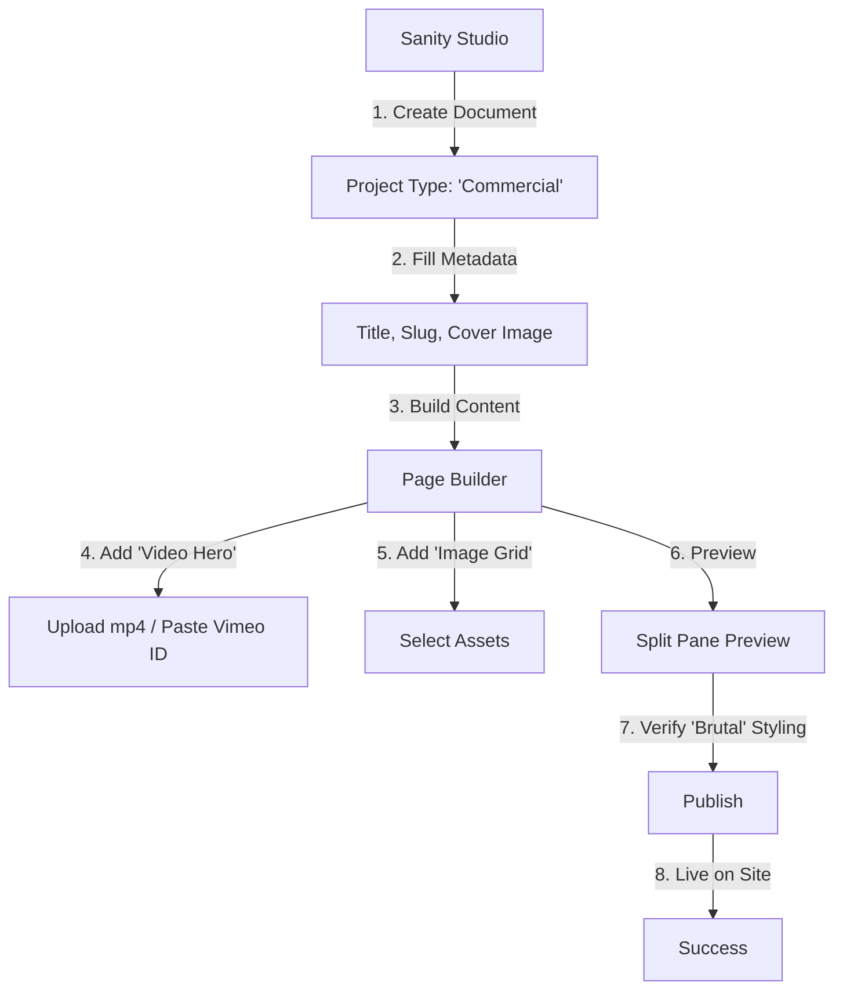
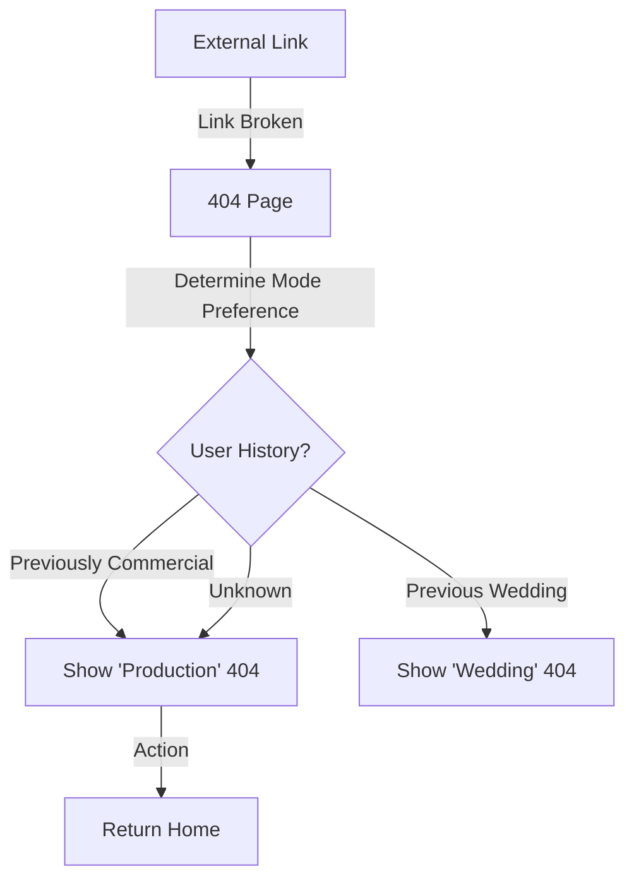
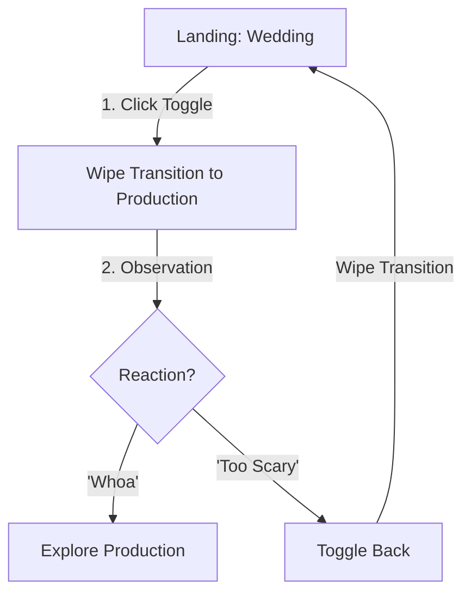

# UX Design Specification 56konfilm

**Author:** Z3tz3r0
**Date:** 2026-01-29

---

<!-- UX design content will be appended sequentially through collaborative workflow steps -->

## Executive Summary

### Project Vision
56konfilm is a high-end, dual-identity portfolio platform designed to serve two distinct audiences: Commercial Production Agencies and Wedding Clients. The platform leverages a "Dual-Mode Architecture" to instantly transform its entire aesthetic, content, and tone between a "Brutal/High-Motion" production mode and an "Emotive/Gentle" wedding mode. The core goal is to deliver a cinematic, award-winning user experience while ensuring operational efficiency for the business owner through a code-free, modular content management system (Sanity CMS).

### Target Users
1.  **The Agency Creative (Commercial Mode):** Tech-savvy, seeks "edge," high-energy motion, and a sharp showreel. Values industry-standard aesthetics and technical capability.
2.  **The Modern Couple (Wedding Mode):** Gen-Z/Millennial, seeks emotional connection, romance, and trust. Values storytelling and a gentle browsing experience.
3.  **The Business Owner (Admin):** Non-technical power user. Needs a "Lego-like" capability to build layouts and manage two distinct content universes without developer intervention.

### Key Design Challenges
*   **The "Switch" Experience:** Designing a seamless, state-preserving transition between two polar opposite design systems (Colors, Typography, Layout) without disorienting the user.
*   **Performance vs. Aesthetics:** Achieving a 100/100 Lighthouse score while implementing "Brutal Motion," heavy video backgrounds, and complex micro-interactions (e.g., video hover states).
*   **Mobile-First Cinematic Video:** Ensuring the "Showreel" and "Previous Work" grids deliver a premium video experience on mobile (1-column layout) without overwhelming bandwidth or usability.
*   **Unified Admin Experience:** Creating a Sanity Studio structure that clearly separates the two modes while sharing underlying logic, preventing content leakage between "worlds."

### Design Opportunities
*   **"The Switch" as a Brand Signature:** Turning the mode toggle into a "Wow" moment (micro-interaction) that users want to play with, reinforcing the studio's versatility.
*   **Immersive Video Interaction:** utilizing the "hover-to-play" (desktop) and "auto-play visible" (mobile) patterns defined in design assets to make the portfolio feel alive.
*   **Trust-Building Elements:** Strategic placement of "Testimonials" (Carousel) and "Project Details" to bridge the gap between visual awe and conversion.

## Core User Experience

### Defining Experience
The core experience is defined by the **"Dual-World Switch."** Users do not just browse a portfolio; they enter a specific *atmosphere*. The most critical interaction is the transition between the **Commercial Production Mode** (High-energy, technical, dark) and the **Wedding Studio Mode** (Emotional, gentle, light). This switch must be instantaneous, immersive, and context-preserving, creating the illusion of two distinct companies under one roof.

### Platform Strategy
*   **Primary Platform:** Mobile Web (Safari/Chrome on iOS/Android). The design assets clearly prioritize mobile-first video behaviors (1-column grid).
*   **Secondary Platform:** Desktop Web (Large canvas for full-screen video impact).
*   **Tech Stack:** Next.js 16+ (App Router), Tailwind CSS 4, Framer Motion/Lenis for smooth scrolling, Sanity CMS for content.
*   **Performance Constraint:** Must achieve 100/100 Lighthouse score despite heavy video usage.

### Effortless Interactions
*   **Zero-Click Vibe Shift:** The mode toggle (Global Navigation) instantly swaps theme, fonts, and content without a full page reload or complex menu diving.
*   **Auto-Play on Scroll:** On mobile, videos in the portfolio grid play automatically when they enter the viewport, eliminating the need to "tap to view" for quick scanning.
*   **Hover-to-Reveal (Desktop):** Mouse movement drives content exploration; hovering a project card plays the trailer, creating a dynamic surface that feels alive.

### Critical Success Moments
1.  **The First Toggle:** When a user first clicks "Commercial" or "Wedding," the site must transform *smoothly* (no flash of unstyled content). If this feels clunky, the "Dual-Identity" promise fails.
2.  **The Showreel Hook:** The Hero video must load instantly (LCP < 2.5s). If the showreel buffers, the "premium production house" image is shattered immediately.
3.  **The Admin "Lego" Build:** When the Owner drags a "Hero Section" above a "Grid Section" in Sanity, it must reflect 1:1 on the frontend preview. If the admin experience deviates from the frontend, operational efficiency (15-min landing page goal) is lost.

### Experience Principles
1.  **Motion is Meaning:** Animations are not decoration; they signal context. Fast/Sharp cuts for Commercial, Slow/Fade transitions for Wedding.
2.  **Content First, Chrome Second:** UI elements (Nav, Buttons) recede to let full-bleed video content dominate the screen.
3.  **One Site, Two Souls:** Every shared component (Button, Card, Footer) must have a distinct visual state for both modes.

## Desired Emotional Response

### Primary Emotional Goals
*   **Awe (The Hook):** Users should feel immediate visual impact upon loading the site. The 60fps motion and full-screen video should signal "top-tier quality" instantly.
*   **Playfulness (The Switch):** The toggle between modes shouldn't just be functional; it should be fun. We want users to click it back and forth just to watch the world transform, creating a sense of delight and discovery.
*   **Confidence (The Content):** Whether an Agency Producer or a Bride, the user must feel absolute confidence in 56konfilm’s ability to deliver. The UX must scream "professional competence."

### Emotional Journey Mapping
1.  **Arrival (Anticipation):** User lands. Fast load time + Hero Video Loop builds anticipation. *Feeling: "Who are these people? This looks expensive."*
2.  **Exploration (Immersion):** User scrolls. Video cards play on hover/scroll. *Feeling: "The work is alive. I want to see more."*
3.  **The Switch (Surprise):** User clicks the toggle. The site morphs. *Feeling: "Wow, they can do BOTH? That's impressive technology."*
4.  **Conversion (Trust):** User reads the "About" or "Services" section (which matches their mode). *Feeling: "They get me. I'm ready to contact them."*

### Micro-Emotions
*   **Commercial Mode:** *Intensity, Precision, Edge.* The dark theme and sharp motion should make the user feel like they are working with a cutting-edge studio.
*   **Wedding Mode:** *Warmth, Romance, Intimacy.* The light theme and gentle fades should make the user feel safe and emotionally understood.
*   **Admin Mode:** *Power, Mastery, Relief.* The owner should feel "I am in control of my brand" when using the easy drag-and-drop backend.

### Design Implications
*   **To evoke "Intensity" (Commercial):** Use high-contrast typography (All Caps), rapid transition timings (0.3s), and dark backgrounds.
*   **To evoke "Romance" (Wedding):** Use serif/elegant typography, slower transition timings (0.8s), and abundance of negative space/light.
*   **To evoke "Power" (Admin):** Ensure the CMS preview is 100% accurate to the frontend. Nothing kills the feeling of mastery like a "broken preview."

### Emotional Design Principles
*   **Atmosphere over Information:** We prioritize *feeling* the vibe of the video over reading dense text.
*   **Interaction is Magic:** Every click and hover should have a response. A dead interface kills the emotional momentum.
*   **Respect the Context:** Never show "Commercial" aggression in "Wedding" mode, and vice versa. The emotional wall between the two worlds must be absolute until the user chooses to switch.

## UX Pattern Analysis & Inspiration

### Inspiring Products & Patterns Analysis
*   **Selective Reference Strategy:** We will only look to external products for *missing* layouts or specifically for **complex micro-interactions**. We already have strong static designs; the goal is to breathe life into them, not replace them.
*   **The "Alive" Interface:** Every component, no matter how small, must provide feedback. The interface shouldn't just be a static page; it should respond to presence and intent.

### Transferable UX Patterns (Micro-Interaction Focus)
*   **Entrance Choreography:**
    *   **Images & Videos:** Never just "appear." Use scroll-triggered entrance animations (e.g., subtle scale-up, reveal from mask, parallax movement relative to scroll speed).
    *   **Text:** Staggered line-by-line reveal or character shuffle effect (scramble text) for headers to feel technical/cinematic.
*   **Smart Button Feedback:**
    *   **Beyond Scale:** Don't just scale up/down.
    *   **Icon Animation:** If a button has an arrow, the arrow should slide out right and reappear from left on hover. If it’s a "Play" button, it might morph into a "Pause" shape or pulse subtly.
    *   **Border/Fill Flow:** Borders might draw themselves around the button, or background fills might sweep in from a corner.
*   **Parallax & Depth:**
    *   Use `lenis` and `framer-motion` to create velocity differences. Background elements move slower than foreground content, creating a subtle 3D feeling while scrolling.

### Anti-Patterns to Avoid
*   **The "Dead" Click:** Clicking or tapping something without immediate visual ripple or state change.
*   **Slow-Mo Feedback:** Animations that are too slow (>0.4s for UI feedback) make the site feel heavy. Feedback must be snappy (approx 0.2s - 0.3s).
*   **Over-Animation (The "Jelly" Effect):** Avoid erratic bouncing or spring physics that feel childish. The motion must be "Cinematic" (smooth easing), not "Cartoonish."

### Design Inspiration Strategy
*   **Adopt:** A policy of **"No Static Elements."** Even a simple text link must have a hover state (e.g., underline expands from center).
*   **Adapt:** Parallax scrolling patterns from high-end editorials, applied to our specific "Dual Mode" grids.
*   **Strategy:** Use animation to provide **Texture** and **Feedback**, not just distraction. It must feel "Expensive" — purposeful, measured, and perfectly timed.

## Design System Foundation

### 1.1 Design System Choice
**Strategy:** "Headless & Utility-First" Hybrid
*   **Component Logic:** **shadcn/ui** (Headless Radix UI + Tailwind). This provides accessible, functional primitives (Dialogs, Tabs, Carousel) without forcing a visual style.
*   **Styling Engine:** **Tailwind CSS v4** (Utility-first). This facilitates the "Dual Mode" theming via CSS variables.
*   **Motion Engine:** **Framer Motion** + **Lenis** (for smooth scrolling).
*   **Icons:** **Lucide React** (clean, standard) + Custom SVG assets for specialized brand icons.

### Rationale for Selection
1.  **Extreme Theming Flexibility:** We need to switch fonts, spacing, roundness, and colors instantly between "Commercial" and "Wedding" modes. shadcn/ui exposes these as simple CSS variables (`--radius`, `--font-primary`, `--background`), making the "Switch" technically trivial to implement.
2.  **Performance:** Headless libraries ship zero styles by default. We only ship the Tailwind classes we use. This is critical for hitting that 100/100 Lighthouse score.
3.  **Owner-Friendly:** The "Lego-like" admin requirement matches shadcn's component architecture. We can wrap these primitives into "Sanity Blocks" easily.
4.  **Micro-Interaction Ready:** Since we need custom entrance animations and button behaviors, having full control over the DOM (via Radix primitives) allows Framer Motion to intervene without fighting a UI framework's internal styling.

### Implementation Approach
*   **Global Variables:** Define two distinct roots in `globals.css`:
    *   `:root` (Default/Commercial): Dark mode colors, Inter/display fonts, sharp corners.
    *   `.wedding-mode`: Light mode colors, Serif fonts, rounded corners.
*   **Component Architecture:**
    *   Create base components (e.g., `<Button />`) that blindly consume CSS variables.
    *   The "Mode Switcher" simply toggles the `.wedding-mode` class on the `<body>` or outer-most layout wrapper, initiating the global re-theme instantly.

### Customization Strategy
*   **Typography:** Define `font-sans` (Commercial) and `font-serif` (Wedding) tokens.
*   **Animation Tokens:** Define standard durations:
    *   `--duration-fast: 300ms` (Commercial)
    *   `--duration-slow: 800ms` (Wedding)
*   **Z-Index Strategy:** Critical for the full-screen video overlays and sticky navs. We will establish a strict z-index scale to prevent content overlap issues.

## 2. Core User Experience

### 2.1 Defining Experience
The defining experience is **"Immersive Mode-Switching."** Unlike a standard dark mode toggle, this interaction completely changes the user's emotional context—audio, visual, and content—in a single click. It allows the user to say, "Show me the other side of your personality," and recieve an instant, theatrical response.

### 2.2 User Mental Model
*   **Current Model:** Users are used to "Dark Mode" as a utility toggle (same content, different colors).
*   **New Model:** We are introducing a "Channel Switch" metaphor. Like flipping a TV channel from MTV (Commercial) to Hallmark (Wedding).
*   **Expectation:** Users expect the structure to remain familiar (navigation shouldn't disappear), but the *vibe* to change completely.

### 2.3 Success Criteria
*   **Latency:** The switch must happen in < 150ms. Any lag breaks the illusion.
*   **Continuity:** Scroll position should be preserved (conceptually) where possible, or reset intelligently if the content trees are vastly different.
*   **Discovery:** 100% of new users must interact with the toggle within the first 10 seconds. It is the site's main toy.

### 2.4 Novel UX Patterns
*   **The "Curtain Wipe" Transition:** Instead of a hard cut, we will overlay a mask that wipes across the screen during the theme change. This masks any potential React rendering glitches and adds cinematic flair.
*   **Scroll-Triggered Micro-Video:** Instead of clicking "Play," video elements listen to the scroll position. When a video is center-viewport, it plays. This creates a "Director's Cut" feeling where the user is editing the experience just by scrolling.

### 2.5 Experience Mechanics
**The Switch Mechanism:**
1.  **Initiation:** User clicks the "Weddings / Commercial" Toggle in the Sticky Nav.
2.  **Interaction:** The toggle knob slides to the other side.
3.  **Feedback:**
    *   **Layer 1:** A "Wipe" animation covers the screen (Duration: 300ms).
    *   **Layer 2 (Behind):** The DOM updates (Root class toggled, content re-fetched/re-rendered).
    *   **Layer 3:** The Wipe reveals the new world.
4.  **Completion:** The user lands on the *equivalent* page in the new mode (e.g., Home -> Home), but with the new aesthetic fully applied.

## Visual Design Foundation

### Color System (Implemented in globals.css)
The system uses a CSS Variable architecture where `:root` defines the "Wedding" (Light) theme and `.dark` defines the "Commercial" (Dark) theme.

**1. Commercial Mode (Dark Class)**
*   **Primary Background:** `Midnight Black (#00040d)` - Deep, rich black.
*   **Secondary Background:** `Espresso (#271b0f)` - Warm dark brown for sections.
*   **Accent:** `Orange (#ff7b07)` - High-energy focus color.
*   **Typography:** `Off-White (#f9f9f9)` / `Light Gray (#c8c8c8)`.

**2. Wedding Mode (Default Root)**
*   **Primary Background:** `Ivory White (#faf7f2)` - Warm, organic paper tone.
*   **Secondary Background:** `Linen Beige (#f3eee8)` - Soft separation.
*   **Primary:** `Mocha Brown (#6d4e3c)` - Used for key UI elements.
*   **Typography:** `Brown (#5b4339)` / `Light Brown (#796b62)`.

### Typography System
*   **Body Font:** `Manrope` (Shared) - Clean, modern sans-serif for readability.
*   **Heading Font (Dynamic):**
    *   **Commercial:** `Sora` - Geometric, technical, wide stance.
    *   **Wedding:** `Cormorant Garamond` - Editorial, elegant, high-contrast serif.

### Spacing & Layout Foundation
*   **Grid:** 4-column (Mobile) / 12-column (Desktop).
*   **Radius:** Defaults to `0.625rem` (10px).
    *   *Recommendation:* Override `--radius` to `0px` in `.dark` mode to enhance the "Brutal" aesthetic required for Commercial mode.

### Accessibility Considerations
*   **Contrast:** The "Orange on Midnight Black" and "Mocha Brown on Ivory" combinations must be verified for AA compliance.
*   **Motion:** `globals.css` imports `tw-animate-css`. We must ensure these classes respect `prefers-reduced-motion`.

## Design Direction Decision

### Design Directions Explored
We analyzed the provided Design Assets (Figma Exports) which clearly establish two distinct art directions:
1.  **Production Mode:** Dark, cinematic, video-heavy, sharp typography (Sora), high contrast (Orange/Black).
2.  **Wedding Mode:** Light, serif-driven (Cormorant), soft imagery, warm tones (Beige/Brown).

### Chosen Direction: "Cinematic Dualism" (Enhanced)
We are adopting the **existing Figma designs** as the visual source of truth but enhancing them with specific interaction patterns defined by user feedback.

**Interactive Enhancements:**
*   **Production Mode:**
    *   **Magnetic Interaction:** Applied *selectively* to high-value Call-to-Actions (e.g., "Play Reel", "Book Now"). It's too aggressive for every link.
    *   **Logic:** The magnetic pull simulates gravity/force, reinforcing the "Technical/Physical" theme of the production house.
*   **Wedding Mode:**
    *   **Drift/Ripple Interaction:** Instead of magnetic pull, hover states will trigger a gentle "Drift" (slow Y-axis float) or a subtle "Ripple/Glow" effect. This reinforces the "Ethereal/Soft" theme.
    *   **Logic:** No sharp movements. Everything floats.

**Navigation Enhancement:**
*   **Soft-Glass Navigation:**
    *   Instead of a hard 1px border, we will use a **"Gradual Blur" mask** at the edges or a very soft inner shadow/highlight.
    *   The goal is to make the nav bar look like a piece of frosted crystal floating *over* the video, creating separation without rigid lines.

### Design Rationale
*   **Contextual Physics:** The physics of the UI match the physics of the brand.
    *   Commercial = Heavy, Magnetic, Sharp.
    *   Wedding = Light, Floating, Soft.
*   **Premium Detailing:** The "Soft Gradual Blur" on the nav is a hallmark of modern high-end interfaces (like Apple Vision Pro OS), elevating the perceived quality instantly.

### Implementation Approach
*   **Magnetic Component:** We will adapt the ReactBit  component, adding a  prop to turn it off in Wedding Mode, and optimizing the event listeners to only activate within a specific proximity radius to prevent event-handler overload.
*   **Glass Utility:** Create a custom Tailwind utility  that utilizes , , and  (for the soft edge) to handle the nav bar styling.

## User Journey Flows

### Journey 1: The Agency Producer (The "Scout")
**Goal:** Assess quality, vet technical capability, and book 56konfilm for a commercial shoot.
**Context:** Desktop/Laptop in office. High intent.
**Visual Reference:** `R01_home_production.png` -> `R03_portfolio_detail.png`



### Journey 2: The Modern Couple (The "Vibe Check")
**Goal:** Feel an emotional connection and trust 56konfilm with their wedding day.
**Context:** Tablet/Laptop at home. Emotional intent.
**Visual Reference:** `W01_landing_page.png` -> `W02_landing_page_detail.png`



### Journey 3: The Content Admin (The Owner)
**Goal:** Create a new "Featured Commercial" project page in under 15 minutes.
**Context:** Sanity Studio v3.



### Journey 4: The Mobile Commuter (Passive Consumption)
**Goal:** Browsing during commute to see "what's cool."
**Context:** Mobile (Portrait). One-hand usage.
**Visual Reference:** Mobile Layout of `R01_home_production.png`

```mermaid
graph TD
    A[Landing: Mobile] -->|1. Auto-Play Hero| B[Scroll Down]
    B -->|2. Grid Item hits Center Viewport| C[Video Autoplays (Muted)]
    C -->|3. User Stops Scrolling| D[Watch Loop]
    D -->|4. Tap Video| E[Unmute / Enter Fullscreen]
    E -->|5. Close| B
```

### Journey 5: The "Service Shopper" (Specific Need)
**Goal:** Find "Do they do Drone shots?" or specific capability.
**Visual Reference:** `R04_services.png`

```mermaid
graph TD
    A[Landing] -->|1. Click Overlay Menu| B[Menu Open (Glass)]
    B -->|2. Click 'Services'| C[Services Page]
    C -->|3. Read Rotating Text 'Think...'| D[Scroll List]
    D -->|4. Expand 'Equipment'| E[Verify RED/Drone]
    E -->|5. Click Sticky 'Contact'| F[Contact Form]
```

### Journey 6: The "Lost" User (Recovery)
**Goal:** Recover from a broken link/deleted project without bounce.
**Context:** 404 Page.



### Journey 7: The Direct Booking (Returning)
**Goal:** Skip the BS, just book.
**Visual Reference:** `R05_contact_us.png`

```mermaid
graph TD
    A[Landing] -->|1. Click 'Contact' (Sticky)| B[Contact Page]
    B -->|2. Browser Autofill| C[Form Filled]
    C -->|3. Submit| D[Success]
    D -->|4. Click 'Call Line'| E[Launch Line App]
```

### Journey 8: The "Cross-Pollinator" (Curiosity)
**Goal:** Play with the brand, explore the duality.
**Interaction:** The "Toy" Factor.



### Journey Patterns
*   **The "Vibe Check" Gate:** Users almost always start on "Production" (Default). The "Switch" is the gate to the secondary journey.
*   **Video-First Discovery:** Deep diving requires clicking, but *vetting* happens entirely via hover/scroll in the feed.
*   **Persistent Inquiry:** The "Book Now" or "Contact" button is sticky in the Nav, ensuring that at any point of "Decision," the action is 0 clicks away.

### Flow Optimization Principles
1.  **No Dead Ends:** Every Project Detail page ends with a "Next Project" suggestion to keep the loop going.
2.  **Contextual Forms:** The Contact form detects the current mode. If in Wedding mode, it asks "Wedding Date" and "Venue." If in Commercial mode, it asks "Agency Name" and "Budget."

## Component Strategy

### Design System Components (shadcn/ui Strategy)
We will leverage `shadcn/ui` *only* for complex accessible primitives. We will strictly strip their default styles and apply our `Dual-Mode` classes.

**Core Primitives to Install:**
1.  **Dialog/Sheet:** For the full-screen "About/Services" overlay menu on mobile.
2.  **Accordion:** For the FAQ section in the "Packages" page.
3.  **Carousel (Embla):** For the "Wedding Testimonials" section (vital for touch Swipe support).
4.  **Form/Input:** For the Contact form (handling validation/accessibility).

**Custom Styling Rule:**
*   All shadcn components must accept a `mode` prop or read the context.
*   Example: Dialog Overlay must be `bg-black/90` in Commercial, but `bg-white/90` in Wedding.

### Custom Components (The "Gaps")
These are the signature interactions that `shadcn` does not provide.

#### 1. MagneticButton (Interactive)
*   **Purpose:** The primary CTA for "Play Reel" and "Book Now".
*   **Behavior:** The button text/container physically moves towards the cursor when hovered within a 50px radius.
*   **Implementation:** `framer-motion` for spring physics + event listener for mouse position.
*   **Wedding Mode:** Feature DISABLED. Replaced by a gentle `scale-105` + `shadow-lg` transition.

#### 2. DualModeSwitcher (Navigation)
*   **Purpose:** The global state toggle.
*   **Behavior:** A sliding "pill" switch that triggers the full-screen "Wipe" transition.
*   **State:** Must persist to `localStorage` immediately.

#### 3. VideoGridItem (Media)
*   **Purpose:** The core building block of the portfolio.
*   **Behavior:**
    *   **Desktop:** Static cover image -> Plays video on Hover.
    *   **Mobile:** Auto-plays when in center of viewport (IntersectionObserver).
*   **Performance:** Must implement lazy-loading (don't load video source until near viewport).

#### 4. RotatingText (Typography)
*   **Purpose:** Cinematic effect for the "Services" section ("We DO [Commercials / Music Videos / Documentaries]").
*   **Implementation:** Custom `AnimatePresence` stack using the `RotatingText` code provided by user.

### Component Implementation Strategy
1.  **"Unstyled" First:** Install shadcn components with the `--no-style` flag or manually strip the tailwind classes in the registry setup to avoid "fighting" the defaults.
2.  **Global "Mode" Context:** Wrap the app in a `ModeProvider` that exposes `isCommercial` boolean to all components to drive logic (not just styles).
3.  **Z-Index Registry:** Define a strict Z-index map in tailwind config (e.g., `z-nav`, `z-overlay`, `z-wipe`) to ensure the "Curtain Wipe" always sits on top of everything.

### Implementation Roadmap
*   **Phase 1 (Core):** `ModeProvider`, `DualModeSwitcher`, `VideoGridItem`, `MagneticButton`. (Enables the core loop).
*   **Phase 2 (Structure):** `Nav` (Glass), `Footer` (Dual), `Hero` (Video).
*   **Phase 3 (Content):** `Carousel` (Testimonials), `Accordion` (FAQ), `RotatingText` (Services).

## Component Strategy

### Design System Components (shadcn/ui Strategy)
We will leverage `shadcn/ui` *only* for complex accessible primitives. We will strictly strip their default styles and apply our `Dual-Mode` classes.

**Core Primitives to Install:**
1.  **Dialog/Sheet:** For the full-screen "About/Services" overlay menu on mobile.
2.  **Accordion:** For the FAQ section in the "Packages" page.
3.  **Carousel (Embla):** For the "Wedding Testimonials" section (vital for touch Swipe support).
4.  **Form/Input:** For the Contact form (handling validation/accessibility).

**Custom Styling Rule:**
*   All shadcn components must accept a `mode` prop or read the context.
*   Example: Dialog Overlay must be `bg-black/90` in Commercial, but `bg-white/90` in Wedding.

### Custom Components (The "Gaps")
These are the signature interactions that `shadcn` does not provide.

#### 1. MagneticButton (Interactive)
*   **Purpose:** The primary CTA for "Play Reel" and "Book Now".
*   **Behavior:** The button text/container physically moves towards the cursor when hovered within a 50px radius.
*   **Implementation:** `framer-motion` for spring physics + event listener for mouse position.
*   **Wedding Mode:** Feature DISABLED. Replaced by a gentle `scale-105` + `shadow-lg` transition.

#### 2. DualModeSwitcher (Navigation)
*   **Purpose:** The global state toggle.
*   **Behavior:** A sliding "pill" switch that triggers the full-screen "Wipe" transition.
*   **State:** Must persist to `localStorage` immediately.

#### 3. VideoGridItem (Media)
*   **Purpose:** The core building block of the portfolio.
*   **Behavior:**
    *   **Desktop:** Static cover image -> Plays video on Hover.
    *   **Mobile:** Auto-plays when in center of viewport (IntersectionObserver).
*   **Performance:** Must implement lazy-loading (don't load video source until near viewport).

#### 4. RotatingText (Typography)
*   **Purpose:** Cinematic effect for the "Services" section ("We DO [Commercials / Music Videos / Documentaries]").
*   **Implementation:** Custom `AnimatePresence` stack using the `RotatingText` code provided by user.

### Component Implementation Strategy
1.  **"Unstyled" First:** Install shadcn components with the `--no-style` flag or manually strip the tailwind classes in the registry setup to avoid "fighting" the defaults.
2.  **Global "Mode" Context:** Wrap the app in a `ModeProvider` that exposes `isCommercial` boolean to all components to drive logic (not just styles).
3.  **Z-Index Registry:** Define a strict Z-index map in tailwind config (e.g., `z-nav`, `z-overlay`, `z-wipe`) to ensure the "Curtain Wipe" always sits on top of everything.

### Implementation Roadmap
*   **Phase 1 (Core):** `ModeProvider`, `DualModeSwitcher`, `VideoGridItem`, `MagneticButton`. (Enables the core loop).
*   **Phase 2 (Structure):** `Nav` (Glass), `Footer` (Dual), `Hero` (Video).
*   **Phase 3 (Content):** `Carousel` (Testimonials), `Accordion` (FAQ), `RotatingText` (Services).

## UX Consistency Patterns

### Button Hierarchy

| Level | Production Mode (Commercial) | Wedding Studio Mode |
| :--- | :--- | :--- |
| **Primary (CTA)** | **MagneticButton**: Sharp corners, Orange bg, high-energy pull. | **SoftButton**: Rounded corners (8px), Gold/Mocha bg, gentle scale. |
| **Secondary** | Ghost Button: 1px Sharp border, "Invert" hover effect. | Soft Ghost: 1px Light border, "Fill" hover effect. |
| **Link/Text** | Underline expands from center, bold. | Underline slides from left, italicized. |

### Feedback Patterns
*   **The Wipe (Global):** Used for mode switching and large page transitions. A 300ms cinematic "curtain" that clears the slate.
*   **Micro-Video (Contextual):** Projects don't just "show" success; they "play" success. Hovering or completing an action triggers a brief loop.
*   **Toasts/Alerts:** Minimal at the bottom-right.
    *   *Commercial:* Bordered, monospace font, sharp.
    *   *Wedding:* Shadowed, serif font, rounded.

### Form Patterns
*   **Floating Labels:** Used for both modes to keep the interface minimal (Chrome-second).
*   **Validation:** Inline errors with a subtle vibrate/shake animation in Commercial mode, and a soft fade-in red text in Wedding mode.
*   **Smart Context:** The contact form automatically shuffles its fields based on the active mode (e.g., asking for "Brand Name" vs. "Wedding Venue").

### Navigation Patterns
*   **The Glass Nav:** A persistent header using `.glass-soft` (Utility discussed in Step 9). No hard borders; just a 40px backdrop-blur with a gradual mask.
*   **Mode Toggle:** The singular focus of the navigation. A distinctive "Switch" that behaves like a physical toggle.
*   **Mobile Drawer:** A full-screen overlay (Radix Sheet) that uses site-wide cinematic transitions when opening.

### Interaction Consistency (The "Alive" Rule)
*   **No Dead Clicks:** Every interactive element must trigger a Framer Motion response (Spring/Ease) within 150ms.
*   **Entrance Choreography:** All sections use a staggered reveal. Headers first, then media, then text.

## UX Consistency Patterns

### Button Hierarchy

| Level | Production Mode (Commercial) | Wedding Studio Mode |
| :--- | :--- | :--- |
| **Primary (CTA)** | **MagneticButton**: Sharp corners, Orange bg, high-energy pull. | **SoftButton**: Rounded corners (8px), Gold/Mocha bg, gentle scale. |
| **Secondary** | Ghost Button: 1px Sharp border, "Invert" hover effect. | Soft Ghost: 1px Light border, "Fill" hover effect. |
| **Link/Text** | Underline expands from center, bold. | Underline slides from left, italicized. |

### Feedback Patterns
*   **The Wipe (Global):** Used for mode switching and large page transitions. A 300ms cinematic "curtain" that clears the slate.
*   **Micro-Video (Contextual):** Projects don't just "show" success; they "play" success. Hovering or completing an action triggers a brief loop.
*   **Toasts/Alerts:** Minimal at the bottom-right.
    *   *Commercial:* Bordered, monospace font, sharp.
    *   *Wedding:* Shadowed, serif font, rounded.

### Form Patterns
*   **Floating Labels:** Used for both modes to keep the interface minimal (Chrome-second).
*   **Validation:** Inline errors with a subtle vibrate/shake animation in Commercial mode, and a soft fade-in red text in Wedding mode.
*   **Smart Context:** The contact form automatically shuffles its fields based on the active mode (e.g., asking for "Brand Name" vs. "Wedding Venue").

### Navigation Patterns
*   **The Glass Nav:** A persistent header using `.glass-soft` (Utility discussed in Step 9). No hard borders; just a 40px backdrop-blur with a gradual mask.
*   **Mode Toggle:** The singular focus of the navigation. A distinctive "Switch" that behaves like a physical toggle.
*   **Mobile Drawer:** A full-screen overlay (Radix Sheet) that uses site-wide cinematic transitions when opening.

### Interaction Consistency (The "Alive" Rule)
*   **No Dead Clicks:** Every interactive element must trigger a Framer Motion response (Spring/Ease) within 150ms.
*   **Entrance Choreography:** All sections use a staggered reveal. Headers first, then media, then text.

## Responsive Design & Accessibility

### Responsive Strategy
*   **Mobile-First Video Experience:** The site is optimized for one-handed mobile browsing. Video grids become single-column to maximize visual impact on small screens.
*   **Fluid Typography:** Font sizes will use clamp() or relative units to ensure headers scale gracefully from mobile to ultra-wide monitors without breaking the cinematic layout.
*   **Touch Optimization:** All interactive elements (Magnetic Buttons, Side-Swipers) have a minimum 44px hit area. Interaction triggers switch from "Hover" (Desktop) to "Scroll-Intersection" (Mobile).

### Breakpoint Strategy
*   **Mobile:** < 768px (Single Column, Center-Autoplay).
*   **Tablet:** 768px - 1024px (2-Column Grid, simplified motion).
*   **Desktop:** > 1024px (3-Column Grid, Magnetic interactions enabled).
*   **Wide:** > 1536px (Max-width container for content to prevent overly long line lengths).

### Accessibility Strategy
*   **Reduced Motion Support:** Users with `prefers-reduced-motion` will skip all high-velocity "Wipe" transitions and magnetic pulls. These will be replaced by 200ms opacity fades.
*   **Focus Management:** The "Mode Switcher" will be the first focusable element for keyboard users. The "Curtain Wipe" will handle focus-trapping during the transition to ensure screen readers don't read the old theme while the new one is loading.
*   **Semantic Video:** Every video item must have a text-based "Summary" in the alt/aria-label field (provided by Sanity) to describe the cinematic content to visually impaired users.
*   **Compliance:** Targeting WCAG 2.1 AA level.

### Testing Strategy
*   **Low Power Mode Check:** Test that the site remains functional on iOS/Android devices when "Low Power Mode" disables autoplay. Poster images must be high-quality and visually consistent.
*   **Cross-Browser Motion:** Verify that Framer Motion animations perform at 60fps on Safari (iOS), Chrome, and Firefox.

### Implementation Guidelines
*   **CSS Variables:** Use the established `globals.css` token system for all responsive adjustments.
*   **Asset Loading:** Implement lazy-loading for all video assets below the fold.
*   **A11y Linting:** Integrate `eslint-plugin-jsx-a11y` to catch missing aria labels during development.

## Responsive Design & Accessibility

### Responsive Strategy
*   **Mobile-First Video Experience:** The site is optimized for one-handed mobile browsing. Video grids become single-column to maximize visual impact on small screens.
*   **Fluid Typography:** Font sizes will use clamp() or relative units to ensure headers scale gracefully from mobile to ultra-wide monitors without breaking the cinematic layout.
*   **Touch Optimization:** All interactive elements (Magnetic Buttons, Side-Swipers) have a minimum 44px hit area. Interaction triggers switch from "Hover" (Desktop) to "Scroll-Intersection" (Mobile).

### Breakpoint Strategy
*   **Mobile:** < 768px (Single Column, Center-Autoplay).
*   **Tablet:** 768px - 1024px (2-Column Grid, simplified motion).
*   **Desktop:** > 1024px (3-Column Grid, Magnetic interactions enabled).
*   **Wide:** > 1536px (Max-width container for content to prevent overly long line lengths).

### Accessibility Strategy
*   **Reduced Motion Support:** Users with `prefers-reduced-motion` will skip all high-velocity "Wipe" transitions and magnetic pulls. These will be replaced by 200ms opacity fades.
*   **Focus Management:** The "Mode Switcher" will be the first focusable element for keyboard users. The "Curtain Wipe" will handle focus-trapping during the transition to ensure screen readers don't read the old theme while the new one is loading.
*   **Semantic Video:** Every video item must have a text-based "Summary" in the alt/aria-label field (provided by Sanity) to describe the cinematic content to visually impaired users.
*   **Compliance:** Targeting WCAG 2.1 AA level.

### Testing Strategy
*   **Low Power Mode Check:** Test that the site remains functional on iOS/Android devices when "Low Power Mode" disables autoplay. Poster images must be high-quality and visually consistent.
*   **Cross-Browser Motion:** Verify that Framer Motion animations perform at 60fps on Safari (iOS), Chrome, and Firefox.

### Implementation Guidelines
*   **CSS Variables:** Use the established `globals.css` token system for all responsive adjustments.
*   **Asset Loading:** Implement lazy-loading for all video assets below the fold.
*   **A11y Linting:** Integrate `eslint-plugin-jsx-a11y` to catch missing aria labels during development.
