# User Journey Flows (Final Specification)

## Journey 1: The Agency Producer (The "Scout")
**Goal:** Assess quality, vet technical capability, and book 56konfilm for a commercial shoot.
**Context:** Desktop/Laptop. High intent.
**Visual Mapping (Strict):** 
1. `production/landing-page/section-hero-desktop.png` (Full-bleed Video Hero)
2. `production/landing-page/section-who-we-are-desktop.png` (OEM Production House Narrative)
3. `production/landing-page/section-our-service-desktop.png` (High-end craft categories)
4. `production/landing-page/section-process-desktop.png` (How we work: Brief -> Creative -> Production -> Delivery)
5. `production/landing-page/section-previous-work-desktop.png` (Portfolio Grid with Muted Trailers)
6. `production/contact-us/section-contact-form-desktop.png` (Orange 'Let's Discuss' Branding)

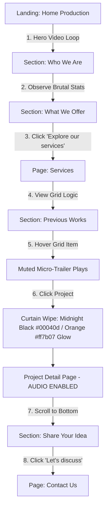

## Journey 2: The Modern Couple (The "Vibe Check")
**Goal:** Feel an emotional connection and trust 56konfilm with their wedding day.
**Context:** Emotional Discovery.
**Visual Mapping (Strict):**
1. `wedding/landing-page/section-hero-desktop.png` (Soft Warm Hero)
2. `wedding/landing-page/section-philosophy-desktop.png` ("We take our craft to heart")
3. `wedding/landing-page/section-featured-desktop.png` (Curated Love Stories)
4. `wedding/landing-page/section-packages-desktop.png` (Tiered Pricing: Cherish, Forever, Grand)
5. `wedding/landing-page/section-testimonial-desktop.png` (Embla Carousel)
6. `wedding/common/section-contact-us-desktop.png` (Talk to our team - Mocha Brown Theme)

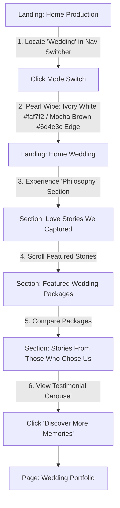

## Journey 3: The Content Admin (The Owner)
**Goal:** Create a new "Featured Commercial" project page in under 15 minutes.
**Behavior:** Flexible Block System based on `production/services/README.md`.

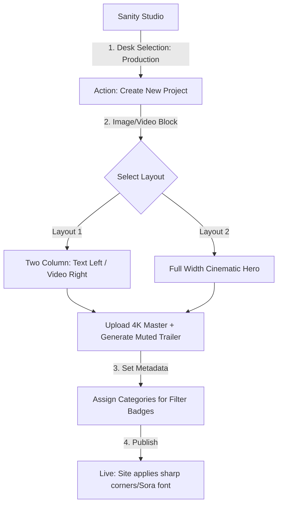

## Journey 4: The Mobile Commuter (Passive Consumption)
**Goal:** Browsing during commute to see "what's cool."
**Visual Mapping:** `production/landing-page/fullpage-landing-page-mobile.png`

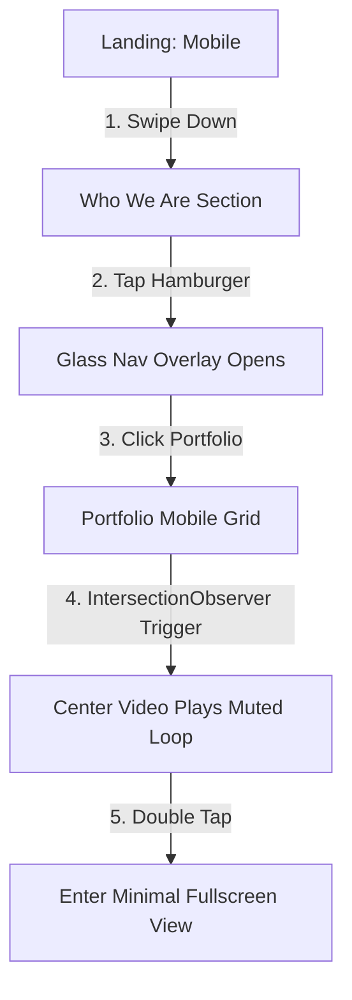

## Journey 5: The "Service Shopper" (Specific Need)
**Goal:** Identify technical capabilities (RED/Drone).
**Visual Mapping:** `production/services/section-all-service-desktop.png`

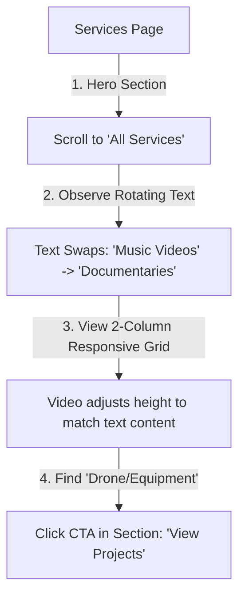

## Journey 6: The "Lost" User (Recovery)
**Goal:** Recover from a broken link/deleted project without bounce.
**Context:** 404 Page.

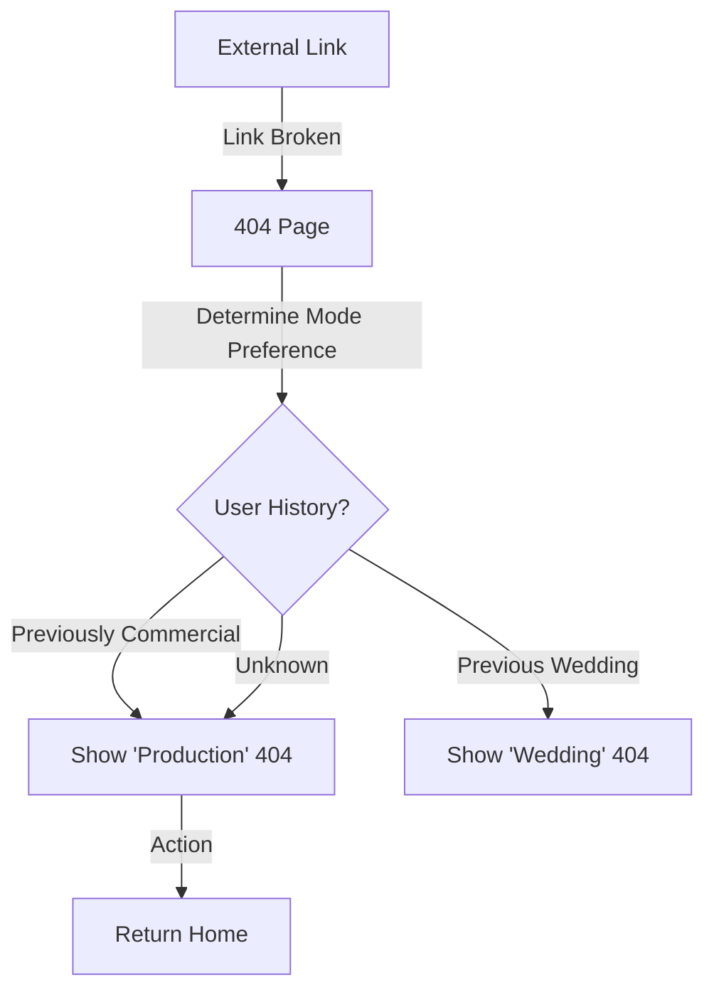

## Journey 9: The "Slow Connection" Experience
**Goal:** Prevent bounce while video loads.
**Interaction:** Low-Res Poster -> Muted Loop.

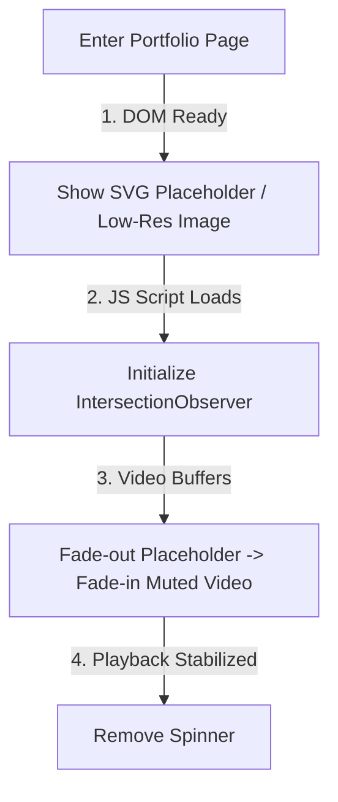

## Journey 10: The "Mode Guardian" (Route Protection)
**Goal:** Resolve context mismatches.

```mermaid
graph TD
    A[Url: /production/portfolio/project-x] -->|1. User Swaps to Wedding Mode| B[System Wipe to Ivory White]
    B -->|2. Check Category| C{Is Project 'Wedding'?|
    C -- No --> D[Redirect to /wedding/portfolio with 'Agency' Toast]
    C -- Yes --> E[Stay on Page but apply Serif fonts/Beige colors]
```

## Journey 11: The "Engagement Loop" (Auto-Advance)
**Goal:** Increase time-on-site for Producers.

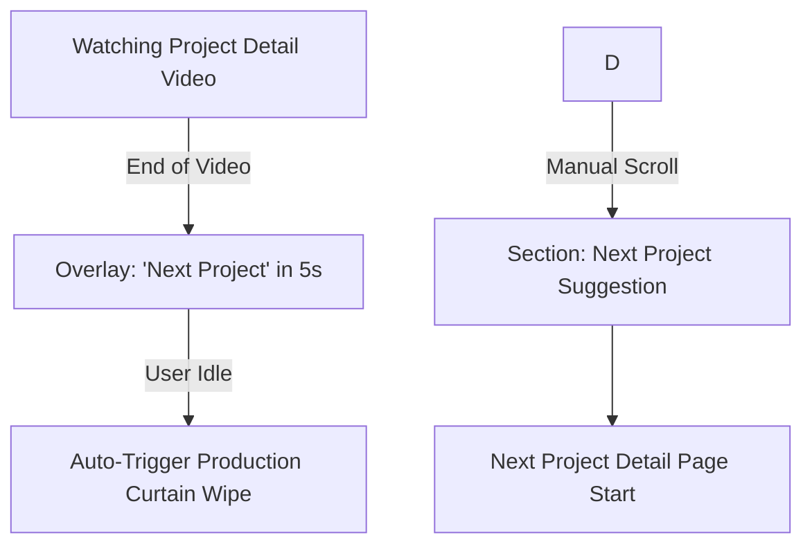

## Journey 12: The "Testimonial Discovery" (Social Proof)
**Goal:** Validate trust for Wedding couples.
**Visual Mapping:** `wedding/landing-page/section-testimonial-desktop.png`

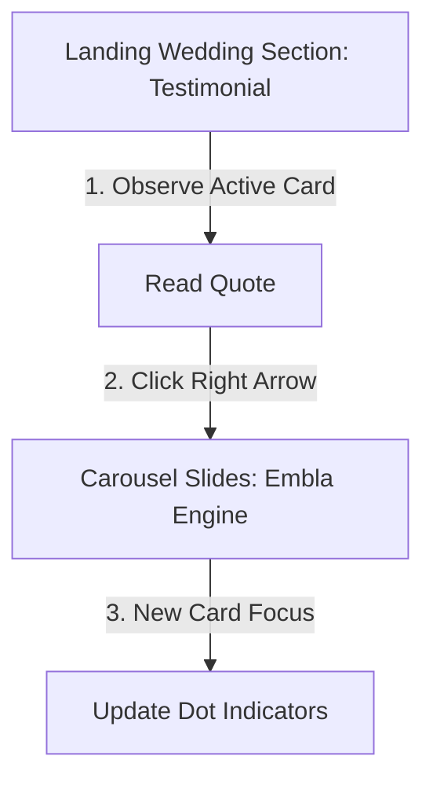

## Journey 13: The "Package Selection" (Conversion)
**Goal:** Direct user to the right price point.
**Visual Mapping:** `wedding/landing-page/section-packages-desktop.png`

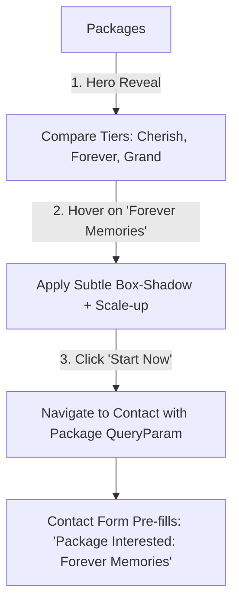

## Journey 15: Behind The Scenes Exploration (Engagement)
**Goal:** See the technical reality and personality of the 56konfilm crew.
**Behavior (per README):** Grid of videos/images.
**Visual Mapping:** `wedding/about-us/section-behind-blog-desktop.png`

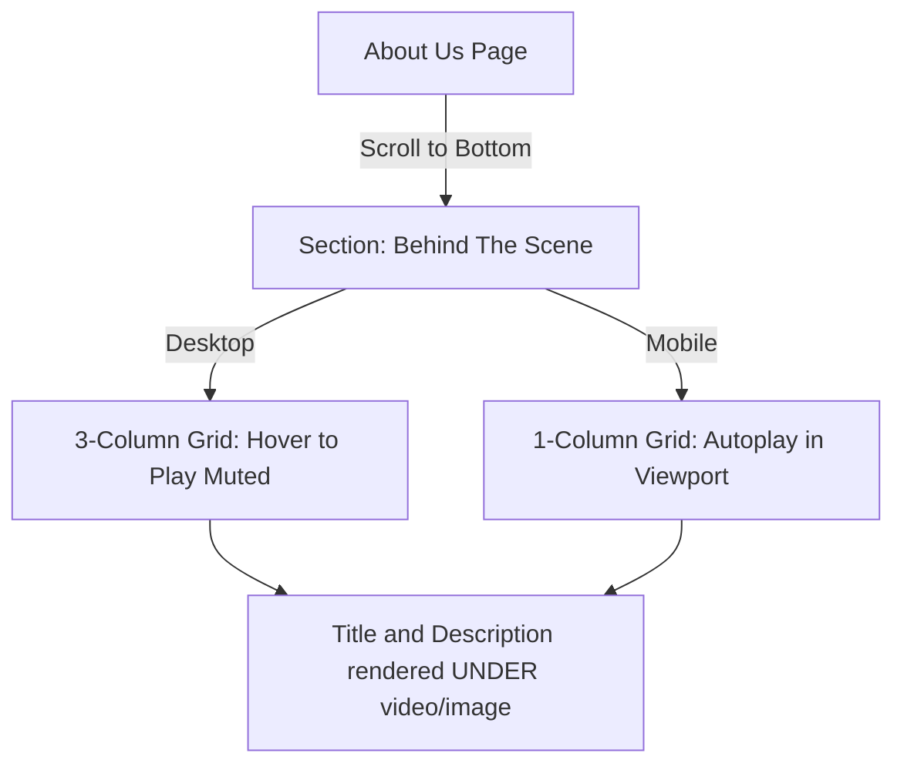

## Journey Patterns
*   **The "Vibe Check" Gate:** Users almost always start on "Production" (Default). The "Switch" is the gate to the secondary journey.
*   **Video-First Discovery:** Vetting happens via muted hover/scroll loops; deep diving requires explicit action.
*   **Persistent Inquiry:** "Book Now" or "Contact" is always accessible, ensuring decision-to-action is zero clicks away.

## Flow Optimization Principles
1.  **No Dead Ends:** Every Project Detail page loop continues with "Next Project" suggestions.
2.  **Contextual Forms:** Forms detect mode (Wedding vs Commercial) to shuffle fields (Wedding Date vs Agency Name).
